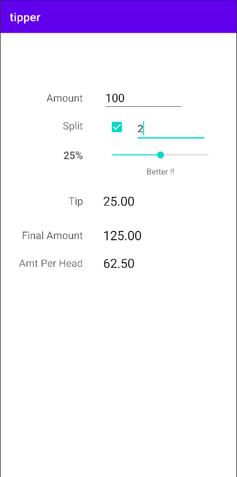

# Tippy - Tip Calculator 

    
    

**Author:** [Shivdatt Jangam](https://www.linkedin.com/in/shivdatt-jangam-96b814254/)

Features:
- Pure Kotlin
- Single screen
- No libraries
- added a extension (Split)

Great Help:
[Rahul Pandey](https://www.youtube.com/rpandey1234)

